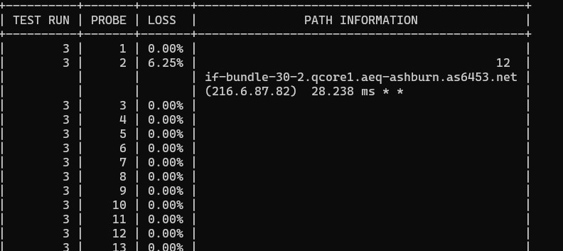

TCP and ICMP based utils that provide reachability reporting for up/down and display points of failure in path where packet loss occurs, similar to MTR but works with TCP pings
when running tcp ping with nextpingtcp ensure that you specify a ttl and timeout >1

evoke eihter via the command line 

sudo ./nextpingtcp cnn.com 80 <-- tcp ping to port 80
sudo ./nextping cnn.com <-- ICMP reachability method

answer the prompts 

Demo output

